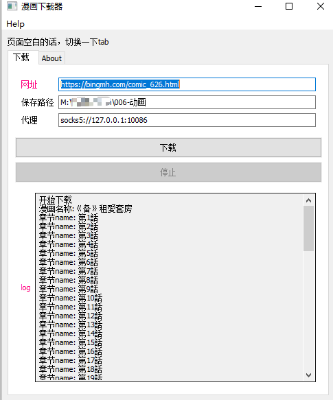

## 使用

`proxy`: 支持 `socks5` `http`

下载：有的网站会限流，会导致失败；失败的图片不会保存；重新下载即可（多次下载的时候遇到磁盘已有文件就跳过）

支持两个网站
- https://www.tuwenhanman.com
- https://bingmh.com

界面截图

## 打包 exe

1. 首先初始化 res
`X:\007-project\010-go-application\go-winres.exe  init`
2. make 生成 .syso, go build 的时候会自动打包进去
`X:\007-project\010-go-application\go-winres.exe  make`
3. 打包成不带控制台的程序 `go build -ldflags="-H windowsgui" .`

也可以用 rsrc 来生成
`X:\007-project\010-go-application\rsrc_windows_amd64.exe -manifest main.manifest -ico .\winres\icon16.ico`

## 编译

`go build -ldflags="-H windowsgui -X main.Version=v1.0" .`